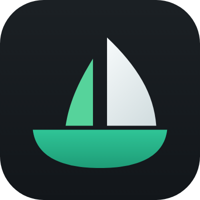
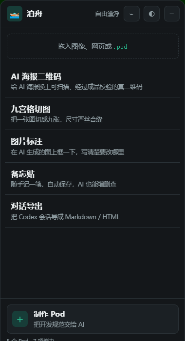
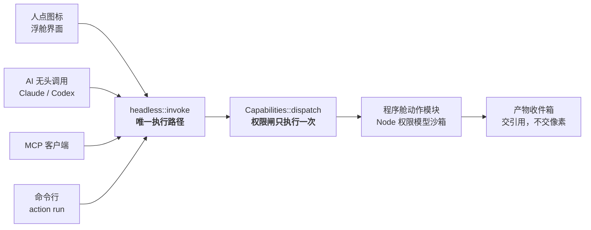

<div align="center">



# 泊舟 AI 小程序 · PodApp

**AI 负责生成，PodApp 负责完成。**

一条贴在 Codex 旁边的窄条。把 AI 生成的东西拖进去，选一个**确定性动作**，看预览、确认、拿结果。

[](https://github.com/dongsheng123132/podapp/actions/workflows/ci.yml)
[](https://github.com/dongsheng123132/podapp/releases/latest)
[](https://github.com/dongsheng123132/podapp/releases)
[](./LICENSE)
[](https://github.com/dongsheng123132/podapp-protocol)

[**⬇ 下载 Windows 版**](https://github.com/dongsheng123132/podapp/releases/latest) ·
[**🌐 podapp.net**](https://podapp.net) ·
[English](./README_EN.md) · 简体中文



</div>

---

AI 会画一张好看的海报，但那个二维码扫不出来。AI 会写一个网页，但你说不清「上面那个标题」是哪一个。
PodApp 就干这一件事：**把 AI 生成的不确定结果，交给确定的动作去加工。**

一个**程序舱（Pod）** = 一份清单 + 一个界面 + 一组稳定动作。
人点图标、AI 无头调用、MCP 客户端调用，**走的是同一条代码路径** —— 这是立身之本，不是可选项。

## 内置 5 个程序舱

| 程序舱 | 它替你做什么 |
|---|---|
| **九宫格切图** | 一张图切成 N×N 张，尺寸严丝合缝，能丢掉 AI 自带的白边；可一次打包成 zip |
| **AI 海报二维码** | 把 AI 画的假二维码换成真的 —— **导出前自己扫一遍，扫不出来就不给你** |
| **图片标注** | 在图上框一下写清楚要改哪里，省得跟 AI 描述「上面那个标题」 |
| **对话导出** | 把 Codex 会话导成 Markdown / HTML |
| **备忘贴** | 随手记一笔，自动保存，AI 也能增删查 |

装一个 `.pod` 包，它**自动成为一个 MCP 工具**。

## 一份实现，两个面



两边各写一遍，第一次改需求就分叉 —— 而且分叉后界面看着还是对的，**AI 那条路悄悄坏掉，没人会发现**。

## 快速开始

```bash
# 用户：下载安装包，双击即可，装完自己检查更新
#   https://github.com/dongsheng123132/podapp/releases/latest

# 开发者
cargo test --workspace                    # 运行时 + 五个 Pod + MCP 桥 + 打包
cargo run --example selftest -p podapp-runtime   # 端到端：装 → 列 → 跑 → 卸，两种方言各一遍

cd apps/podapp-dock && pnpm install && pnpm build
cd src-tauri && cargo test                # 浮舱自己的测试（不在根 workspace 里）

cargo run -p podapp-win --example probe -- --verify   # 吸附对不对，这是唯一客观的验法
```

> `--verify` 是这个项目里最有用的一条命令。「吸附对不对」没法靠截图和肉眼判断，
> 它把浮舱**实际**的窗口矩形和 `dock::place` **算出来**的逐字段比 ——
> 已经靠它抓到两个静默错误：DPI 坐标系混用、系统最小窗口宽度悄悄放大窗口。

## 浮在哪里由你决定

- **吸附宿主** —— 跟随 Codex 主窗口移动；宿主关闭后退到当前屏幕右侧
- **自由漂浮** —— 拖动标题栏或小图标把手，停在任意位置
- **四边四角磁吸**，位置重启后恢复，一键重新吸附
- **声明式皮肤** —— 内置泊舟 / 橘猫 / 极简，可导入 JSON 皮肤

皮肤**不运行第三方 JavaScript / CSS**，只允许标记、颜色和圆角。见
[`docs/SKIN-DEVELOPMENT.md`](./docs/SKIN-DEVELOPMENT.md)。

## 三条不肯让步的设计

<details>
<summary><b>一份实现，两个面</b> —— 人点按钮和 AI 调用走同一条 <code>headless::invoke</code></summary>

<br>

不是两边各写一遍然后祈祷它们一致。那样第一次改需求就分叉，而且分叉后 GUI 看着还是对的，
AI 那条路悄悄坏掉，没人会发现。

这条不是口号 —— 它抓到过真实的 bug：双击 `.pod` 装不上，就是因为「装包」这个业务动作
被放到了界面事件总线上，`setup()` 里 emit 时前端还没注册监听，事件当场丢掉，
而浮舱正常弹出、界面毫无异常。修法是把它移回动作核心。

</details>

<details>
<summary><b>权限闸装在面之下</b> —— 由 <code>Capabilities::dispatch</code> 统一执行一次</summary>

<br>

从 GUI、从无头模块、还是从 devtools 发起，走的是同一道门。能力**只声明**自己要什么权限，
**没有放行的权力**：

```rust
struct QrScan;
impl Capability for QrScan {
    fn name(&self) -> &'static str { "qr" }
    fn handles(&self, v: &str) -> bool { v == "qr.scan" }
    fn required(&self, _: &str) -> Option<Cap> { None }   // 只声明，无权放行
    fn call(&self, ctx: &CapCtx, _: &str, a: &Value) -> Result<Value, String> { … }
}

let caps = Capabilities::builtin().with(QrScan);   // 不用改运行时那个 crate
```

原来七个 `match` 分支各查一次权限，漏写一个就是一条敞开的路，而且没有任何症状。

规范里写「模块 MUST NOT 碰 fs」是对作者的*要求*；Node 权限模型是让它*做不到*。
两者差别是生死攸关的，不能只写在纸上 —— 自检里那个动作模块会真的尝试读用户目录、
真的尝试起子进程，两次都必须被拒。

</details>

<details>
<summary><b>两份标准，一个语义</b> —— <code>.pod</code> 与 <code>.ukapp</code> 共用一个内部模型</summary>

<br>

PodApp Protocol（`podapp.json` / `.pod`）与 ActionParity MiniApp Profile
（`uking-app.json` / `.ukapp`）是两份独立标准，运行时内部只有一个模型。

`tests/roundtrip.rs` 每次构建都断言两者等价 —— **那条测试红了，就是两份标准开始分家了**，
必须当场修，不许 skip、不许加豁免。

</details>

## 它是影核（ActionParity）的实现

不是「基于影核再造一层」。每个程序舱带一份 `action-parity.json`，`.pod` 和 `.ukapp` 共用它。

| 影核规范 | 落在哪 |
|---|---|
| §5.1 一个动作一条实现路径 | `headless::invoke` —— GUI / CLI / 无头 / 影子同一条 |
| §10.3 乐观并发，不许默认「最后写入者获胜」 | `Invocation::expected_state_version` |
| §10.4 全链路同一个关联 ID | `Invocation::execution_id` |
| 宪法 16 远程写要幂等键 | `Invocation::idempotency_key` |

装一个程序舱 = 给这台设备的动作面扩容。影子重新拉一次 `action_specs()` 就发现了新能力 ——
**影核那边不需要为程序舱做任何改动**。

## 仓库结构

```
crates/podapp-runtime/   运行时：清单 / 安装 / 动作分发 / 资源服务 / 权限 / 无头执行
                         只有 4 个依赖（serde, serde_json, flate2, tar），保持这个数字
crates/podapp-win/       找宿主窗口 + 跟随 + 停靠几何（Windows）
crates/podapp-qr/        二维码能力 ┐
crates/podapp-codex/     读 Codex 会话 ├ 可插拔，不进核心；删一个只动 2 个文件
crates/podapp-zip/       打包能力     ┘
crates/podapp-mcp/       装一个 .pod 自动成为 MCP 工具
apps/podapp-dock/        浮舱壳：Tauri 2，吸附 / 热键 / 拖入即装 / podapp:// 协议
pods/                    5 个官方程序舱源码，随桌面壳首次启动自动安装
scripts/build-site.mjs   podapp.net 官网，从 pods/*/podapp.json 生成
```

## 5 分钟做一个 Pod

```bash
npx podapp create my-pod     # 起骨架，自带自检
npx podapp pack my-pod       # 出一个 .pod，双击安装
```

浮舱底部有「制作 Pod」入口，可以把完整开发指令直接复制给 Codex 或 Claude。
规范见 [`docs/POD-DEVELOPMENT.md`](./docs/POD-DEVELOPMENT.md)；
[`pods/memo`](./pods/memo) 是一份可运行的最小参考实现。

## 一起做

不写 Rust 也能贡献：提交一套皮肤、做一个 Pod、补一种语言、复现一个 Bug 都可以。

[`CONTRIBUTING.md`](./CONTRIBUTING.md) ·
[Pod 规范](./docs/POD-DEVELOPMENT.md) ·
[皮肤规范](./docs/SKIN-DEVELOPMENT.md) ·
[生态路线](./docs/ECOSYSTEM.md) ·
[Issues](https://github.com/dongsheng123132/podapp/issues)

## 许可

运行时 Apache-2.0（见 [LICENSE](./LICENSE)）。
PodApp 名称与小船 Logo 属商标，代码许可不覆盖它们 —— 见 [TRADEMARK.md](./TRADEMARK.md)。
