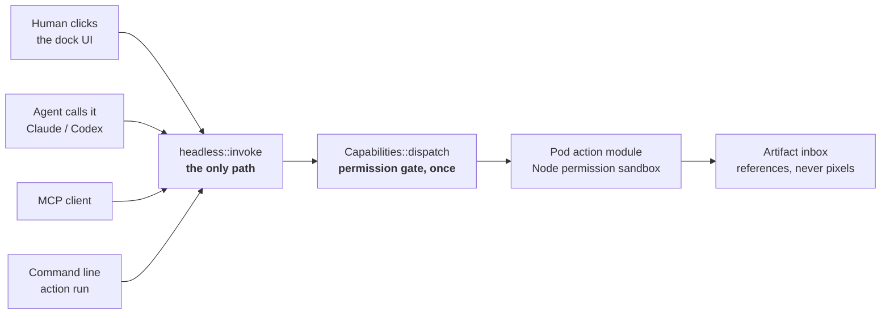

<div align="center">


# PodApp · 泊舟

**AI generates. PodApp finishes.**

A narrow strip that clings beside Codex. Drop what AI made into it, pick a **deterministic action**,
see the preview, confirm, take the result.

[](https://github.com/dongsheng123132/podapp/actions/workflows/ci.yml)
[](https://github.com/dongsheng123132/podapp/releases/latest)
[](https://github.com/dongsheng123132/podapp/releases)
[](./LICENSE)
[](https://github.com/dongsheng123132/podapp-protocol)

[**⬇ Download for Windows**](https://github.com/dongsheng123132/podapp/releases/latest) ·
[**🌐 podapp.net**](https://podapp.net/en) ·
[**AI GUI Manifesto**](./MANIFESTO.md) ·
English · [简体中文](./README.md)


</div>

---

AI draws a beautiful poster, but the QR code scans into nothing. AI writes a page, but you can't
describe which heading you mean. That's the one thing PodApp does:
**hand AI's uncertain output to actions that are certain.**

A **Pod** = one manifest + one UI + a set of stable actions.
Clicking the icon, calling it headless from an agent, and calling it over MCP
**all run the same code path** — that's the foundation, not a nice-to-have.

## The AI GUI Manifesto

> **The future is not No GUI. It is Just Enough GUI.**

AI is good at opening possibilities. Real-world action still needs explicit targets, scope,
authority, and consequences. We call the interface between human intent and probabilistic
intelligence — where both can select and confirm the same action — **AI GUI**.

- Let AI understand and reason.
- Let actions execute.
- Let GUI clarify and confirm.
- Let people retain final authority.

PodApp is an open reference implementation of these ideas, not the manifesto itself. Read the
[`AI GUI Manifesto`](./MANIFESTO.md) ·
[`Principles`](./PRINCIPLES.md) ·
[`Specification map`](./SPEC.md) ·
[`Sign the manifesto`](./SIGNATORIES.md).

## 5 pods included

| Pod | What it does for you |
|---|---|
| **Nine-Grid Splitter** | Split an image into N×N tiles, pixel-exact, dropping the gutter AI leaves behind; zip them in one go |
| **Poster QR Fix** | Replace fake AI QR codes with real ones — **it scans the finished image before handing it back** |
| **Image Annotate** | Box the thing you want changed, so you stop describing "the heading near the top" |
| **Chat Export** | Export Codex sessions to Markdown / HTML |
| **Sticky Memo** | Jot it down, auto-saved, and AI can read and write it too |

Install one `.pod` and it **becomes an MCP tool automatically**.

## One implementation, many surfaces



Write it twice and the first requirement change forks them — and after the fork
**the UI still looks right while the AI path quietly breaks, and nobody notices**.

## Quick start

```bash
# Users: download the installer and double-click. It updates itself afterwards.
#   https://github.com/dongsheng123132/podapp/releases/latest

# Developers
cargo test --workspace                    # runtime + 5 pods + MCP bridge + zip
cargo run --example selftest -p podapp-runtime   # end to end: install → list → run → uninstall

cd apps/podapp-dock && pnpm install && pnpm build
cd src-tauri && cargo test                # the dock's own tests (not in the root workspace)

cargo run -p podapp-win --example probe -- --verify   # is the docking geometry actually right?
```

> `--verify` is the most useful command in this repo. "Is it docked correctly?" cannot be judged
> from a screenshot. It compares the dock's **actual** window rect against what `dock::place`
> **computed**, field by field — it has already caught two silent bugs: mixed DPI coordinate
> spaces, and the OS minimum window width quietly enlarging the window.

## You decide where it floats

- **Attached** — follows the Codex main window; falls back to the right screen edge when it closes
- **Free floating** — drag the title bar or the grip, park it anywhere
- **Snaps to all four edges and corners**, position restored on restart, one click to re-attach
- **Declarative skins** — Boat / Orange Cat / Minimal built in, or import a JSON skin

Skins **run no third-party JavaScript or CSS** — only marks, colours and radii. See
[`docs/SKIN-DEVELOPMENT.md`](./docs/SKIN-DEVELOPMENT.md).

## Three non-negotiables

<details>
<summary><b>One implementation, two faces</b> — the button and the agent share <code>headless::invoke</code></summary>

<br>

Not "write it twice and hope they agree". That forks on the first requirement change, and after
the fork the GUI still looks right while the AI path quietly breaks.

This isn't a slogan — it caught a real bug. Double-clicking a `.pod` didn't install it, because
"install a package" (a business action) had been put on the UI event bus: `setup()` emitted the
event before the webview had registered its listener, so it was dropped on the floor while the
dock popped up looking perfectly normal. The fix was to move it back into the action core.

</details>

<details>
<summary><b>The permission gate sits below the surface</b> — enforced once, by <code>Capabilities::dispatch</code></summary>

<br>

Whether the call comes from the GUI, a headless module, or devtools, it goes through the same door.
A capability **declares** what it needs and **has no power to grant it**:

```rust
struct QrScan;
impl Capability for QrScan {
    fn name(&self) -> &'static str { "qr" }
    fn handles(&self, v: &str) -> bool { v == "qr.scan" }
    fn required(&self, _: &str) -> Option<Cap> { None }   // declares only, cannot allow
    fn call(&self, ctx: &CapCtx, _: &str, a: &Value) -> Result<Value, String> { … }
}

let caps = Capabilities::builtin().with(QrScan);   // no change to the runtime crate
```

The previous shape checked permissions in seven separate `match` arms. Miss one and you have an
open door with no symptoms.

A spec saying "the module MUST NOT touch fs" is a *request* to the author; the Node permission
model makes it *impossible*. That difference is the whole game — the selftest's action module
really does try to read the home directory and really does try to spawn a subprocess, and both
must be refused.

</details>

<details>
<summary><b>Two standards, one meaning</b> — <code>.pod</code> and <code>.ukapp</code> share one internal model</summary>

<br>

PodApp Protocol (`podapp.json` / `.pod`) and the ActionParity MiniApp Profile
(`uking-app.json` / `.ukapp`) are two independent standards; the runtime has exactly one model.

`tests/roundtrip.rs` asserts they are equivalent on every build — **if that test goes red, the two
standards have started to drift apart**. Fix it on the spot; no skipping, no exemptions.

</details>

## It *is* the ActionParity implementation

Not "another layer on top of it". Every pod ships an `action-parity.json`, shared by `.pod` and `.ukapp`.

| ActionParity | Where it lands |
|---|---|
| §5.1 one action, one implementation path | `headless::invoke` — GUI / CLI / headless / shadow all share it |
| §10.3 optimistic concurrency, no silent last-writer-wins | `Invocation::expected_state_version` |
| §10.4 one correlation ID end to end | `Invocation::execution_id` |
| Constitution 16, remote writes need an idempotency key | `Invocation::idempotency_key` |

Installing a pod expands this device's action surface. A shadow client re-fetches `action_specs()`
and finds the new capability — **ActionParity needs no changes to accommodate pods**.

## Repo layout

```
crates/podapp-runtime/   runtime: manifest / install / dispatch / asset serving / permissions / headless
                         exactly 4 dependencies (serde, serde_json, flate2, tar) — keep that number
crates/podapp-win/       host-window discovery, following, docking geometry (Windows)
crates/podapp-qr/        QR capability      ┐
crates/podapp-codex/     Codex session read ├ pluggable, out of the core; removing one touches 2 files
crates/podapp-zip/       archive capability ┘
crates/podapp-mcp/       install a .pod, get an MCP tool
apps/podapp-dock/        the dock shell: Tauri 2, docking / hotkey / drop-to-install / podapp://
pods/                    5 official pods, auto-installed on first launch
scripts/build-site.mjs   podapp.net, generated from pods/*/podapp.json
```

## Build a pod in 5 minutes

```bash
npx podapp create my-pod     # scaffold, selftest included
npx podapp pack my-pod       # produces a .pod — double-click to install
```

The dock has a "Build a Pod" entry that copies the full development brief for Codex or Claude.
Spec: [`docs/POD-DEVELOPMENT.md`](./docs/POD-DEVELOPMENT.md).
[`pods/memo`](./pods/memo) is a minimal working reference.

## Contributing

You don't need Rust: ship a skin, build a pod, add a language, reproduce a bug.

[`CONTRIBUTING.md`](./CONTRIBUTING.md) ·
[`CODE_OF_CONDUCT.md`](./CODE_OF_CONDUCT.md) ·
[Pod spec](./docs/POD-DEVELOPMENT.md) ·
[Skin spec](./docs/SKIN-DEVELOPMENT.md) ·
[Ecosystem](./docs/ECOSYSTEM.md) ·
[Issues](https://github.com/dongsheng123132/podapp/issues)

## Licence

Runtime under Apache-2.0 (see [LICENSE](./LICENSE)).
The two AI GUI Manifesto texts are licensed under CC BY 4.0 for signing, translation, and sharing.
The PodApp name and the boat logo are trademarks and are **not** covered by the code licence —
see [TRADEMARK.md](./TRADEMARK.md).
